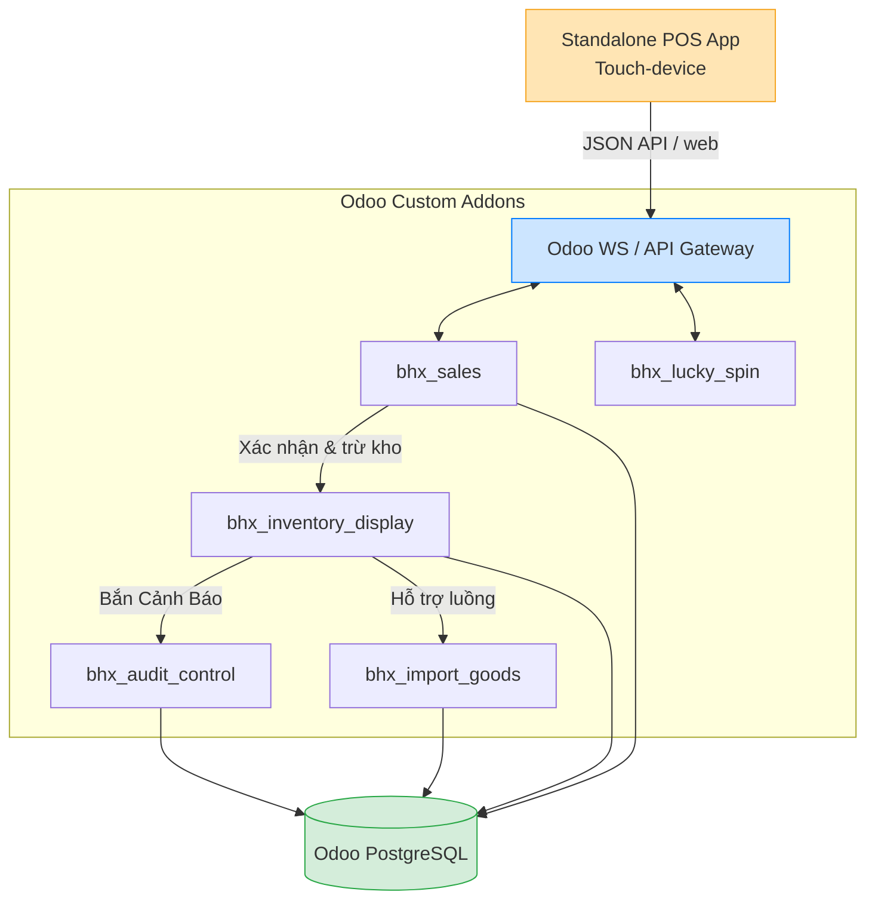

# Business Requirement Document (BRD) - Hệ Sinh Thái Bách Hóa Xanh (BHX Odoo ERP)

Hệ thống Bách Hóa Xanh (Odoo ERP) là một nền tảng phần mềm trung tâm, được phát triển thông qua **5 modules riêng biệt (addons)** nhằm đồng bộ toàn bộ chuỗi hoạt động từ nhập hàng, quản lý kho, trưng bày, điểm bán lẻ (POS) đến các chương trình khuyến mãi.

Dưới góc nhìn Business Analyst, tài liệu này mô tả chi tiết yêu cầu nghiệp vụ dựa trên framework chuẩn.

---

## 1. Business Context (Bối Cảnh Kinh Doanh)
### Business Model
Chuỗi bán lẻ Bách Hóa Xanh vận hành thông qua 3 lớp chính:
1. **Central Warehouse / Suppliers (Tổng Kho / NCC)**
   - Cung ứng nguyên liệu, hàng hóa FMCG, hàng tươi sống.
   - Kiểm soát nhập/xuất sỉ.
2. **Retail Store Inventory (Kho Cửa Hàng & Không Gian Trưng Bày)**
   - Nhận hàng từ tổng kho.
   - Châm hàng từ kho dự trữ lên kệ trưng bày.
3. **Point of Sale (Điểm Bán Lẻ)**
   - Quản lý ca làm việc, thu ngân, in bill.
   - Tương tác trực tiếp với khách hàng (Bán hàng, vòng quay may mắn).

👉 *Rủi ro nếu không có ERP tập trung: Tổ đứt gãy giữa thông tin tồn kho trên hệ thống và số lượng thực tế ngoài kệ.*

---

## 2. Problem Analysis (Phân Tích Vấn Đề)
**Vấn đề cốt lõi (AS-IS):** Quy trình quản lý từ Nhập - Lưu Kho - Bán - Kiểm kê diễn ra rời rạc. Tồn kho hạch toán chậm, gây thất đứt gãy thông tin châm hàng.

### Phân Tích Tác Động (Impact)
| Vấn Đề Hiện Tại | Tác Động Thực Tế | Nguyên Nhân Gốc Gễ (Root Causes) |
| --- | --- | --- |
| Tồn kho không đồng bộ realtime | Cửa hàng báo hết, hệ thống báo còn | Do phần mềm POS không trừ trực tiếp tồn kho thực. |
| Kệ hàng trống nhưng không châm | Khách không thấy hàng, mất doanh thu | Thiếu hệ thống Cảnh Báo thông minh (Smart Alert). |
| Khó kiểm soát hàng cận date / hao hụt | Tỉ lệ hủy hàng cao | Quy trình kiểm đồ ăn tươi sống/rau củ thủ công. |
| Hệ thống POS quá nặng nề | Thanh toán chậm, nghẽn quầy | Load quá nhiều JS/CSS thừa từ Framework gốc. |

---

## 3. High-Level Solution Architecture (Kiến Trúc 5 Modules Lõi)
Giải pháp là xây dựng 5 module Odoo (`addons`) chuyên biệt, hoạt động liên đới với nhau theo thời gian thực (Real-time).

| Tên Module Odoo | Vai Trò (Module Description) |
| --- | --- |
| **`bhx_import_goods`** | **Quản lý Nhập Hàng**: Chịu trách nhiệm nhập FMCG, hàng Fresh. Đẩy lượng hàng hóa vào kho cửa hàng. |
| **`bhx_inventory_display`**| **Quản lý Kho & Trưng Bày**: Set layout kệ hàng. Tự động sinh `Stock Alerts` yêu cầu châm hàng khi tồn trên kệ dưới mức Min. |
| **`bhx_audit_control`** | **Kiểm Soát Kiểm Kê & Hao Hụt**: Kế thừa `Alerts` để tạo yêu cầu *Inventory Count* (Kiểm đếm trực tiếp) và *Disposal* (Bảo hủy hàng hư). |
| **`bhx_sales`** | **Giao diện Bán Hàng (POS)**: Standalone UI cực nhẹ cho thu ngân. Thanh toán và *Trừ tồn kho ngay lập tức* vào vị trí kệ thực tế. |
| **`bhx_lucky_spin`** | **Vòng Quay May Mắn**: Gamification. Tạo trò chơi cho khách hàng đạt chuẩn doanh số, thưởng lưu vào thẻ rổ của khách. |

---

## 4. AS-IS Process (Quy Trình Thủ Công AS-IS)
**Bottlenecks (Nút Thắt Tựu Trung):** Sự phân mảnh giữa các công cụ tiếp nhận, nhập liệu trùng lặp (double-entry), tiêu tốn nhiều nguồn lực cho thao tác chụp ảnh xác nhận (photo audit) và sự thiếu đồng bộ Inventory theo thời gian thực (Real-time).

| Quy Trình | Tác Nhân (Actor) | Hành Động Giải Quyết (Action) | Công Cụ Sử Dụng | Nút Thắt Định Cứ (Bottleneck) |
| --- | --- | --- | --- | --- |
| **1. Nhập hàng (FMCG / Fresh)** | Bảo vệ, Nhân viên kho | Đối chiếu PO giấy, cân tay hàng thịt/rau củ rồi in tem lẻ. Hàng sai lệch so với đơn phải nhập bù thủ công vào Excel hoặc App ngoài. | PO Giấy, Excel, Cân điện tử rời, App ngoài | Nhập liệu hai lần tại kho, sai số cục bộ, mất thời gian đồng bộ vào hệ thống chính dữ liệu mua hàng. |
| **2. Châm hàng lên kệ**| Nhân viên cửa hàng | Kiểm tra kệ hụt hàng bằng mắt/tay, lấy hàng từ kho hẻm ra bổ sung. **Bắt buộc chụp ảnh** báo cáo hoàn tất châm hàng. | Điện thoại di động (Camera) | Tốn công sức đếm hàng bằng tay, quy trình chụp hình báo cáo rườm rà mất năng suất thao tác. |
| **3. Kiểm Date & Hủy Hàng** | Nhân viên quầy, Quản lý | Phát hiện hàng cận/hết date, chụp ảnh gửi Quản lý phê duyệt. Khi hủy phải tiêu hủy vật lý trước Camera an ninh để chứng minh. | Zalo, Nhóm chat, Camera An Ninh | Quy trình chờ cấp trên duyệt ảnh kéo dài thời gian, tốn dung lượng, thủ tục giấy tờ quá nặng nề. |
| **4. Thanh toán (Checkout)** | Thu ngân, Khách hàng | Quét Barcode, thao tác chọn phương thức thanh toán. Với rau củ chưa dán tem phải đặt cân thủ công ngay tại quầy. | POS Legacy, Cân thủ công | Máy POS xử lý trễ (Lag) 5-10s, thao tác cân hàng tại quầy cản trở tốc độ giờ cao điểm. |

---

## 5. TO-BE Process (Hệ Thống Tự Động Hóa TO-BE)
**Improvements (Cải Tiến):** Real-time data, Automatic restocking triggers, Traceability.

| Bước | Hệ Thống Tự Động | Phân Hệ Phụ Trách (Module) |
| --- | --- | --- |
| 1 | Hệ sinh thái tự động bắt Cảnh Báo Kệ Trống (Tồn < Min) | `bhx_inventory_display` |
| 2 | Push Notification lên Dashboard hoặc tự động tạo Đơn nhập | `bhx_import_goods` |
| 3 | Nhân sự tiến hành kiểm kê lại phần hư, hao hụt nếu có | `bhx_audit_control` |
| 4 | Đặt hàng lên kệ, cập nhật tồn sẵn sàng bán. | Quản lý Nội bộ |
| 5 | POS quét mã vạch => Thanh Toán => Kho kệ trừ ngay lập tức | `bhx_sales` |

---

## 6. Key Use Cases

### Use Case 1: Tiếp nhận & Nhập kho hàng hóa (Receiving Goods)
- **Actor:** Nhân viên nhận hàng / Trưởng cửa hàng
- **Triggers:** Hết hàng dự báo hoặc Hàng từ Tổng kho / NCC giao đến điểm bán.
- **Flow:** `Đối chiếu Purchase Order / App Nội Bộ ➔ Cân trọng lượng & In tem (nếu là Fresh) / Quét mã Barcode (FMCG) ➔ Verify số lượng thực nhận ➔ Confirm Receipt ➔ Hàng ghi nhận tự động vào Kho Cửa Hàng (bhx_import_goods)`.

### Use Case 2: Tự động châm hàng (Auto Replenishment)
- **Actor:** Trưởng Cửa Hàng / Nhân viên kệ
- **Triggers:** Hệ thống tự động định kỳ quyét kệ (`location.line`) rớt mốc tồn.
- **Flow:** `System Alert ➔ Report Missing Stock ➔ Generate Internal Transfer Task ➔ Staff Confirm Châm Hàng`.

### Use Case 3: Thanh toán & Trừ kho Realtime (POS Checkout)
- **Actor:** Thu ngân tại quầy
- **Flow:** `Gõ/Quét Mã Vạch ➔ Apply Loyalty (Lucky Spin) ➔ Bấm Quick Cash ➔ Call API /bhx/pos/validate_order ➔ Trực tiếp trừ lượng hàng hiển thị trên kệ ➔ Print Bill`.

### Use Case 4: Xử lý hàng cận date/Hư hỏng (Quality Audit)
- **Actor:** Nhân viên quản lý Chất lượng
- **Flow:** `Nhận Stock Alert (FEFO) ➔ Chuyển thành phiếu Inventory Count ➔ Phát hiện hàng không đạt chất lượng ➔ Lập yêu cầu Disposal trên hệ thống ➔ Quản lý duyệt ➔ Trừ kho hao hụt`.

---

## 7. Role & Authorization (Phân Quyền Xử Lý Cảnh Báo)
Cảnh báo (Stock Alerts) là "trái tim" của hệ thống tự động hóa. Việc AI/Hệ thống hay Con người được quyền Can thiệp (Tạo / Xóa / Duyệt) được quy định chặt chẽ:

| Chức Danh (Role) | Quyền Tạo Cảnh Báo (Create Alert) | Quyền Xử Lý / Phê Duyệt (Process/Approve) |
| --- | --- | --- |
| **System (Tự động hóa)** | ✔️ **Chủ lực:** Tự động quyét bằng Odoo CronJob để tạo Cảnh Báo khi vơi kệ (Tồn < Min) hoặc hàng chạm ngưỡng đáo hạn (FEFO). | ❌ Không có quyền tự đóng cảnh báo nếu chưa thỏa mãn điều kiện thực tế (Phải chờ người xác nhận). |
| **Store Manager (Trưởng CH)** | ✔️ Được tạo cảnh báo thủ công đột xuất (Ví dụ: khách làm đổ vỡ, hư hỏng hiện trường). | ✔️ **Toàn quyền:** Duyệt các yêu cầu châm hàng từ kho dự trữ và cao nhất là phê duyệt lệnh Hủy hàng (Disposal). |
| **Store Staff (Nhân viên)** | ❌ Không được tự ý tạo cảnh báo hụt tồn kho (sai lệch hệ thống). | ✔️ **Tiếp nhận:** Nhận thông báo Alert để lấy hàng từ kho ra kệ, hoặc chụp ảnh gửi báo cáo. Không được xóa Alert định danh. |
| **QC Staff (NV Chất lượng)** | ✔️ Tạo cảnh báo thủ công khi đi kiểm tra lô hàng tươi sống (Fresh) không đạt yêu cầu cảm quan. | ✔️ Tiếp nhận cảnh báo để tạo phiếu kiểm kê (Inventory Count) nhưng cần Quản lý duyệt chốt số liệu. |

---

## 8. Data Model (Core Entities)
| Object Cốt Lõi | Module Chịu Trách Nhiệm | Mô Tả |
| --- | --- | --- |
| **Product & Stock Location**| `bhx_inventory_display` | Quản lý mặt hàng, vị trí quầy/kệ chi tiết từng li. |
| **Stock Alert** | `bhx_inventory_display` | Lệnh báo động tồn kho. |
| **Purchase / Import Order**| `bhx_import_goods` | Phiếu yêu cầu nhập hoặc bổ sung hàng. |
| **Audit / Disposal Record** | `bhx_audit_control` | Hồ sơ kiểm kê hàng tươi / hàng bỏ đi. |
| **POS Order & Shift** | `bhx_sales` | Phiếu thanh toán và Quản lý ca trực thu ngân. |

---

## 9. Key KPIs (Chỉ Số Hiệu Suất Đo Lường)
| Tên KPI | Ý Nghĩa (Meaning) |
| --- | --- |
| **On-shelf Availability** | Tỉ lệ hàng hóa luôn có mặt tại quầy/kệ khi khách tìm. |
| **POS Response Time** | Độ trễ khi in hóa đơn và trừ kho (Mục tiêu < 1 giây). |
| **Waste Rate (Shrinkage)**| Tỉ lệ tiêu hao / hủy bỏ thực phẩm tươi sống. |
| **Alert Resolution Time** | Thời gian từ lúc Cảnh báo Sinh ra đến lúc Kệ được châm lại đầy. |

---

## 10. System Benefits (Lợi Ích Của Odoo BHX)
- **Vận Hành (Operational):** Đồng bộ tuyệt đối. Nhân viên biết chính xác nên châm hàng vào quầy nào thay vì đi mò mẫm. Standalone POS giảm ách tắc giờ cao điểm.
- **Tài Chính (Financial):** Hạn chế tình trạng vứt bỏ hàng cận Date nhờ Audit Process. Luôn có hàng phục vụ khách, không mất doanh thu ẩn.
- **Chiến Lược (Strategic):** Triển khai (Deploy) dễ dàng cho các chi nhánh mới thông qua môi trường Docker linh hoạt.

---

## 11. Suggested System Architecture

